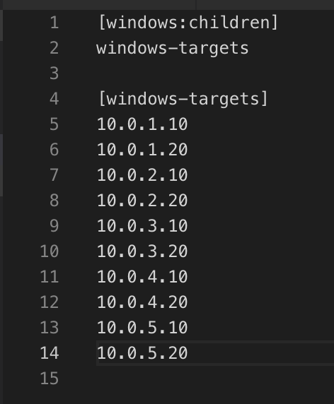
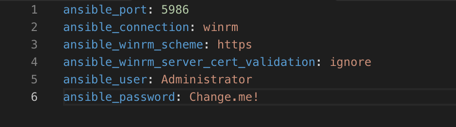
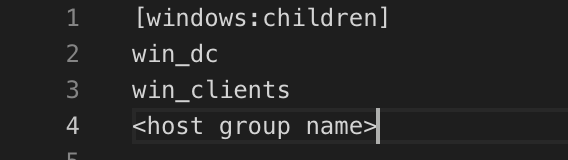
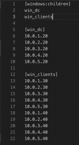

# Windows Deployment

## How to setup WinRM on a Windows machine
1. Start a Powershell prompt as Administrator
1. `Set-ExecutionPolicy Unrestricted`
1. `powershell -NoProfile -ExecutionPolicy Bypass -Command "iex ((new-object net.webclient).DownloadString('https://raw.githubusercontent.com/ansible/ansible/devel/examples/scripts/ConfigureRemotingForAnsible.ps1'))"`
1. `netstat -ano | findstr "LIST"`
    1. If there is a service listening on ports 5985 and 5986 that should be WinRM

## Install/Setup Ansible + PyWinRM
1. MacOS
    1. `brew install python3 python-pip3`
    1. `pip3 install ansible pywinrm`
1. Ubuntu
    1. `apt-get install python3 python-pip3`
    1. `pip3 install ansible pywinrm`
1. Ansible docs
    1. [Ansible installation guide](https://docs.ansible.com/ansible/latest/installation_guide/intro_installation.html)
1. Ansible PyWinRM docs
    1. [Windows Remote Management](https://docs.ansible.com/ansible/latest/user_guide/windows_winrm.html)
    1. [WinRM+Ansible](https://digitalist.global/talks/winrmansible/)
    1. [Managing Windows Servers with Ansible](https://www.bloggingforlogging.com/2017/10/12/managing-windows-servers-with-ansible/)

## Setup multiple targets with the SAME credentials
### Configure hosts.ini
1. `cp hosts-same-pass.ini hosts.ini`
1. `vim hosts.ini` and add IP addresses under [windows-targets]
    1. 

### Configure group_vars/windows.yml
1. `cp group_vars/windows-same-pass.yml group_vars/windows.yml`
1. `vim group_vars/windows.yml` and set:
    1. `ansible_user` – Set to an administrator account on box
    1. `ansible_password` – Enter the password for the account above
    1. 

## Setup multiple targets with DIFFERENT credentials
### Configure hosts.ini
1. `cp hosts-diff-pass.ini hosts.ini`
1. `vim hosts.ini` and add:
1. Create hosts group and add each group name under “[windows:children]”
    1. 
1. Under each host group add IP addresses
    1. 

### Configure group_vars/windows.yml
1. `cp group_vars/windows-diff-pass.yml windows.yml`
1. `vim group_vars/<host group name>.yml` and set:
    1. `ansible_user` – Set to an administrator account on box
    1. `ansible_password` – Enter the password for the account above
1. `vim group_vars/<host group name>.yml` and set:
    1. `ansible_user` – Set to an administrator account on box
    1. `ansible_password` – Enter the password for the account above

## Adding shenanigans
### Add web drive-by
1. `vim cmd/malicious_cmds.txt` and add commands
    1. Any line starting with a `#` will be treated as a comment

### Add binaries
1. `vim group_vars/all.yml` and set:
    1. `windows_malware_loc` – Location binaries will be copied too AND executed from
    1. Default: `C:\Windows\System32\`
1. `cp <malicious binary name>.exe exes/<malicious binary name>.exe`
    1. Binary MUST have an extension of “exe”

## Deploy the minions!!!!!!
1. `ansible-playbook -i hosts.ini deploy_malware.yml`

## Download Ansible deployment template
1. `git clone https://github.com/CptOfEvilMinions/RedTeamWindowsDeployment.git`

## Resources/Sources
* [Managing Windows machines with Ansible](https://medium.com/the-sysadmin/managing-windows-machines-with-ansible-60395445069f)
* [Github – Powershell WinRM setup](https://raw.githubusercontent.com/ansible/ansible/devel/examples/scripts/ConfigureRemotingForAnsible.ps1)
* [How to Start/Stop Windows Remote Management (WS-Management)](https://computerstepbystep.com/windows_remote_management_(ws_management)_service.html)
* [Metasploit: How to use multi/handler](https://kb.help.rapid7.com/discuss/598ab88172371b000f5a4675)
* [Metasplot: Binary Payloads](https://www.offensive-security.com/metasploit-unleashed/binary-payloads/)